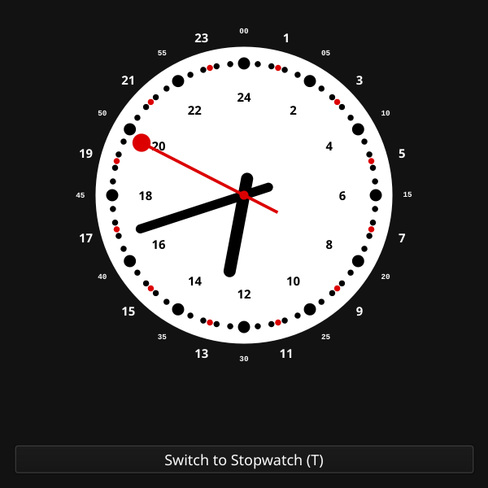
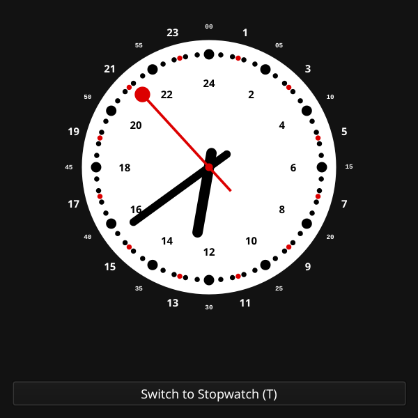
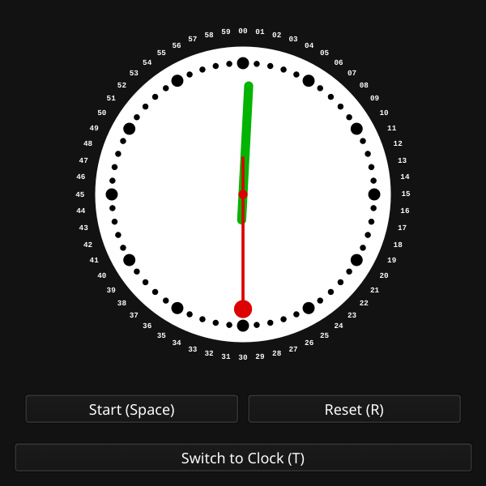
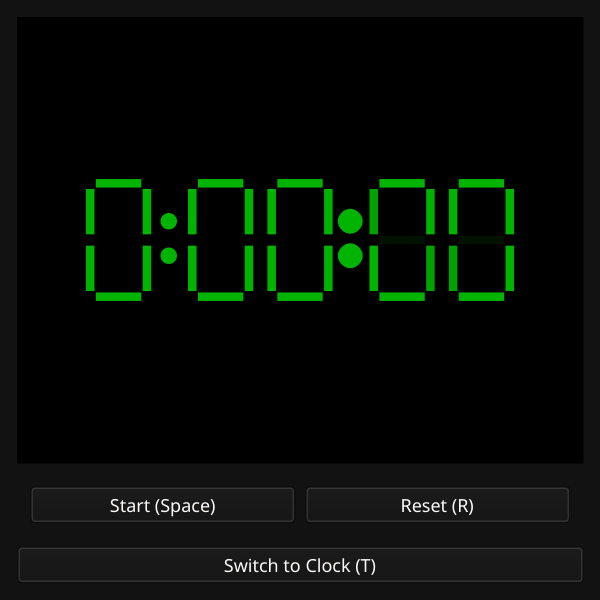

# SwissClock

A Swiss Railways inspired unified analog clock and morphing digital stopwatch *vibed into existence with Gemini 3.1 Pro*

## Modes

### Analog Clock

### Analog Stopwatch

### Morphing Digital Stopwatch

## Keyboard Shortcuts
- **`T`**: Switch between Clock and Stopwatch
- **`Space`**: Start / Stop / Resume Stopwatch
- **`R`**: Reset Stopwatch
- **`D`**: Toggle Digital / Analog mode (in Stopwatch)
- **`F`**: Toggle Fullscreen mode
